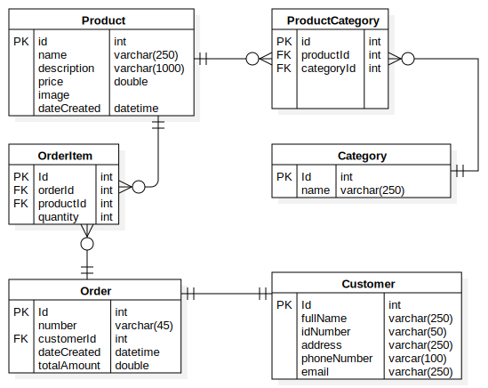

# Fast shopping api

[](https://dev.azure.com/wahio/wahio/_build/latest?definitionId=46&branchName=master)


## Demo api/client, with automatic CI/CD

-   SERVER: [https://fastshoppingappserver.azurewebsites.net](https://fastshoppingappserver.azurewebsites.net).
-   CLIENT: [https://fastshopping.z13.web.core.windows.net](https://fastshopping.z13.web.core.windows.net).

## Database config

add the following parameters in the environment variable group, To use it locally please create the .env file and assign the values

| PARAM      | EXAMPLE     | DESCRIPTION       |
| ---------- | ----------- | ----------------- |
| DB_HOST    | host        | Host name         |
| DB_NAME    | storeapp_db | Dababase name     |
| DB_PASS    | 1234        | Database password |
| DB_USER    | root        | Database user     |
| DB_DIALECT | mysql       | Database          |

-   Available databases 'mysql' | 'mariadb' | 'postgres' | 'mssql'

## Er diagram database



## Database demo script in mysql

-   Script file: [db/database.sql](db/database.sql)

-   60 products with images

## Available Scripts

### `npm run dev`

Runs the app in the development mode.<br>
Open [http://localhost:5500](http://localhost:5500) to view it in the browser.

### `npm test`

### `npm run build`

# ENDPOINTS

## products

-   POST: url/products/pages • get products in pages

```json
{
    "currentPage": 1,
    "pageSize": 20
}
```

-   POST: url/products • create product

```json
{
    "name": "Costoso shoes",
    "description": "The description",
    "image": "www.image.com",
    "price": 190
}
```

-   PUT url/products/:id --- body: product
-   GET: url/products • get list
-   GET: url/products/:id • get one
-   DELETE: url/products/:id • remove one

## orders

-   POST: url/orders • create order with items

```json
{
    "customerId": "1000",
    "items": [
        {
            "productId": "2",
            "quantity": 234
        },
        {
            "productId": "3",
            "quantity": 367
        }
    ]
}
```

with a new customer

```json
{
    "customerId": null,
    "customer": {
            "fullName": "Christian Oporto",
            "idNumber": "104123",
            "address": "Envigado antioquia",
            "phoneNumber": "3012023423",
            "email": "name@mail.com"
        }
    ...
}
```

-   the same crud ...

## categories

-   POST: url/categories • create one

```json
{
    "name": "My category"
}
```

-   the same crud...

# product categories

-   POST: url/productcategories • create one

```json
{
    "categoryId": "ADFJK34",
    "productId": "fasdfasf"
}
```

-   the same crud...

## customers

```json
{
    "fullName": "Christian Oporto",
    "idNumber": "104123",
    "address": "Envigado antioquia",
    "phoneNumber": "3012023423",
    "email": "name@mail.com"
}
```
